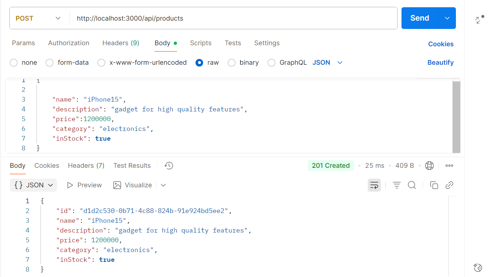
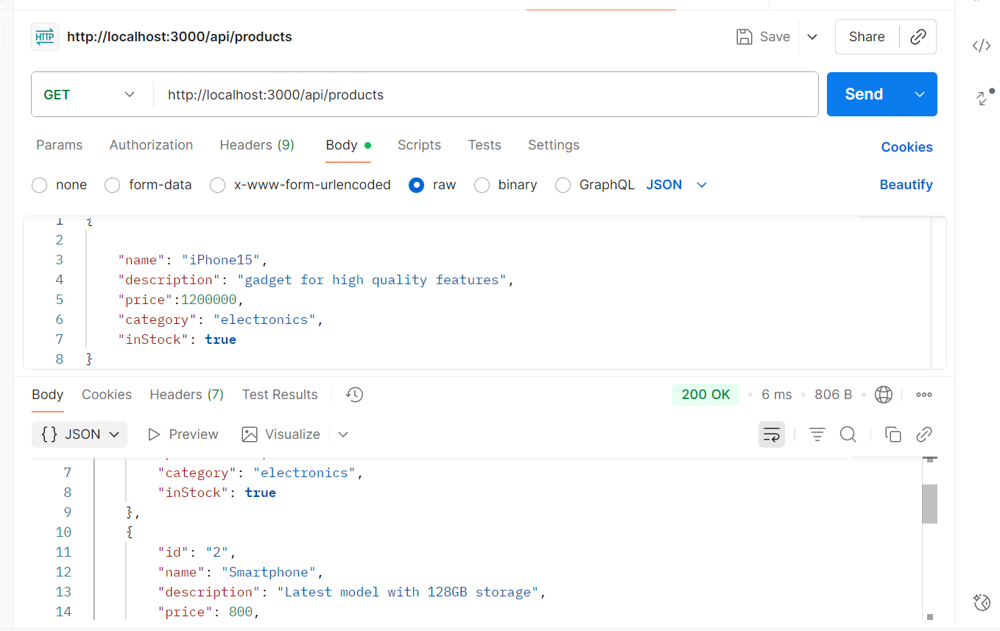
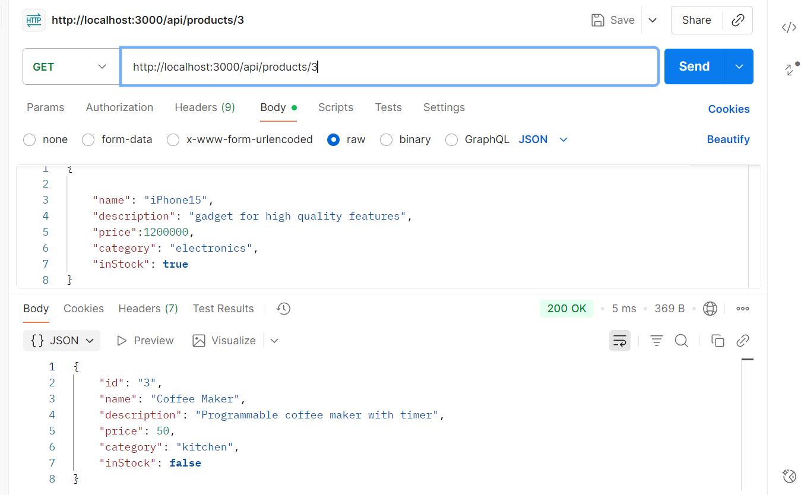
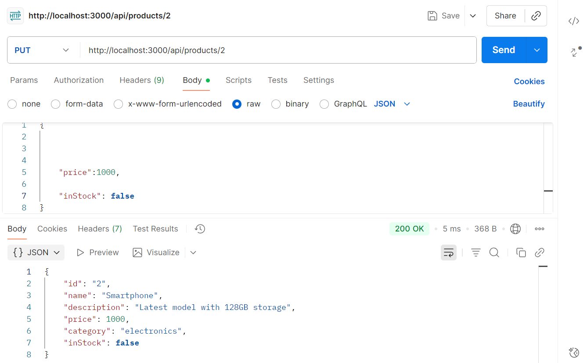
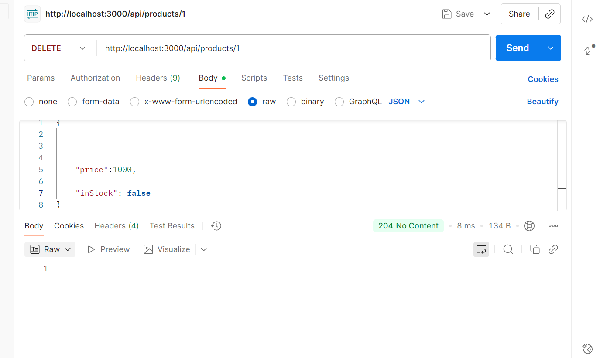

#  Express.js Product API – Week 2 Assignment

### 🖼️ Screenshots

#### 1. Create Product


#### 2. Read All Products


#### 3. Read Product by ID


#### 4. Update Product


#### 5. Delete Product



##  Overview

This project is a fully functional RESTful API built with Express.js. It manages a `products` resource with complete CRUD operations, middleware for logging, authentication, and validation, robust error handling, and advanced features like filtering, pagination, search, and statistics.

---

##  Setup Instructions

###  Prerequisites
- Node.js v18 or higher
- Postman or curl for testing

###  Installation
```bash
git clone <your-assignment-repo-url>
cd <your-repo-folder>
npm install
```

###  Environment Variables
Create a `.env` file based on `.env.example`:
```env
PORT=3000
API_KEY=your-secret-key
```

### ▶ Run the Server
```bash
node server.js
```

Server will start at:  
`http://localhost:3000`

---

##  API Endpoints

All endpoints require the header:  
`x-api-key: your-secret-key`

###  Root
- `GET /`  
Returns welcome message.

---

###  Products CRUD

| Method | Endpoint                  | Description                  |
|--------|---------------------------|------------------------------|
| GET    | `/api/products`           | List all products            |
| GET    | `/api/products/:id`       | Get product by ID            |
| POST   | `/api/products`           | Create a new product         |
| PUT    | `/api/products/:id`       | Update an existing product   |
| DELETE | `/api/products/:id`       | Delete a product             |

---

### 🔍 Advanced Features

| Method | Endpoint                                | Description                          |
|--------|-----------------------------------------|--------------------------------------|
| GET    | `/api/products?category=electronics`    | Filter products by category          |
| GET    | `/api/products?page=2&limit=5`          | Paginate product list                |
| GET    | `/api/products/search?name=laptop`      | Search products by name              |
| GET    | `/api/products/stats/category`          | Get product count by category        |

---

##  Sample Requests

###  Headers
```http
x-api-key: your-secret-key
```

###  Create Product
```http
POST /api/products
Content-Type: application/json

{
  "name": "Blender",
  "description": "High-speed kitchen blender",
  "price": 150,
  "category": "kitchen",
  "inStock": true
}
```

###  Update Product
```http
PUT /api/products/1
Content-Type: application/json

{
  "price": 1100,
  "inStock": false
}
```

###  Delete Product
```http
DELETE /api/products/1
```

---

##  Middleware

- **Logger**: Logs method, URL, and timestamp
- **Authentication**: Requires valid `x-api-key`
- **Validation**: Ensures product data is correct
- **Error Handler**: Catches and formats errors

---

##  Project Structure

```
server.js
.env.example
README.md
```

All logic is contained in `server.js` for simplicity and grading clarity.

---


